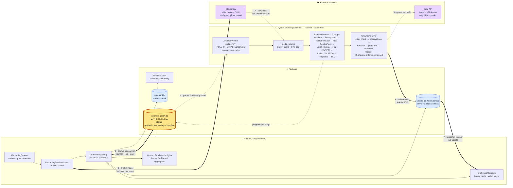

# Solenne — System Architecture

## The one thing to know first

**The Flutter app never calls the Python backend.** There are no REST or GraphQL
endpoints anywhere in this repository — no Flask, FastAPI, Django, or Cloud
Functions.

The two halves are coupled entirely through **Cloud Firestore acting as a job
queue** (the top-level `analysis_jobs` collection), with **Cloudinary as the
media transport**. The client uploads a video, writes a queued job, and moves on.
A separate Python worker polls for that job, does the analysis, and writes
results back into the journal document. The client sees the results appear
through a Firestore snapshot listener.

Anyone reading this codebase looking for an API server will not find one. That is
by design, not an omission.

## Overview

**Legend** — Thick arrows (`==>`) are the primary write path. Dotted arrows
(`-.->`) are asynchronous or polled: nothing on a dotted edge blocks the user.
The numbered steps trace one recording end to end.

## Why the queue seam matters

The client is never trusted to write analysis results. `firestore.rules` allows
`create` on both `journals` and `analysis_jobs` but sets `update: if false` on
each — only the Admin SDK worker can mutate results. Job creation is additionally
cross-checked with `getAfter()` so a job can only reference a journal owned by
the same uid.

The worker defends its own input too: `validate_cloudinary_video_url()` requires
https, a host of exactly `res.cloudinary.com`, the expected path prefix and
`solenne/journals` folder marker, refuses redirects, and caps downloaded bytes.
Temporary media is written to a `TemporaryDirectory` and deleted after every run.

## What is deliberately not here

Marked explicitly because their absence is easy to misread as something missing:

| Not used | Instead |
|---|---|
| HTTP API / REST endpoints | Firestore `analysis_jobs` queue |
| Firebase Storage | Cloudinary |
| Cloud Functions | Standalone Python worker (Docker) |
| Firebase Hosting | *(none configured — `firebase.json` has only `firestore`)* |
| Vector database / embeddings | Deterministic keyword→`claimType` match over a static catalog |
| OpenAI · Anthropic · Gemini | Groq only |
| Cloud speech-to-text API | faster-whisper, locally on CPU |
| FCM push notifications | *(planned in docs, not implemented)* |
| CI/CD pipeline | *(none — no `.github/`, no Cloud Build)* |

Note that `go_router` is declared in `pubspec.yaml` but entirely unused;
navigation is imperative `Navigator.push` with a custom `fadeThroughRoute()`.

## Node → source map

| Diagram node | File |
|---|---|
| RecordingScreen | [recording_screen.dart](../frontend/lib/screens/recording/recording_screen.dart) |
| RecordingPreviewScreen | [recording_preview_screen.dart](../frontend/lib/screens/recording/recording_preview_screen.dart) |
| DailyInsightScreen | [daily_insight_screen.dart](../frontend/lib/screens/insights/daily_insight_screen.dart) |
| Tab shell | [app_shell.dart](../frontend/lib/screens/app_shell.dart) |
| JournalRepository · providers | [journal_repository.dart](../frontend/lib/features/journals/journal_repository.dart) |
| Auth providers | [auth_providers.dart](../frontend/lib/features/auth/auth_providers.dart) |
| Insight evidence models | [insight_evidence.dart](../frontend/lib/features/journals/insight_evidence.dart) |
| Cloudinary upload | [cloudinary_providers.dart](../frontend/lib/services/cloudinary/cloudinary_providers.dart) |
| Client config | [app_config.dart](../frontend/lib/core/config/app_config.dart) |
| AnalysisWorker | [worker/runner.py](../backend/solenne_analyzer/worker/runner.py) |
| Firestore gateway | [worker/firebase_gateway.py](../backend/solenne_analyzer/worker/firebase_gateway.py) |
| SSRF guard · download | [worker/media_source.py](../backend/solenne_analyzer/worker/media_source.py) |
| Result mapping | [worker/result_mapper.py](../backend/solenne_analyzer/worker/result_mapper.py) |
| PipelineRunner (9 stages) | [pipeline/orchestrator.py](../backend/solenne_analyzer/pipeline/orchestrator.py) |
| LLM insight routing | [pipeline/llm_insights.py](../backend/solenne_analyzer/pipeline/llm_insights.py) |
| Groq client | [ai/groq_client.py](../backend/solenne_analyzer/ai/groq_client.py) |
| Grounding retriever | [grounding/retriever.py](../backend/solenne_analyzer/grounding/retriever.py) |
| Grounding generator | [grounding/generator.py](../backend/solenne_analyzer/grounding/generator.py) |
| Research catalog | [grounding/catalog.json](../backend/solenne_analyzer/grounding/catalog.json) |
| Security rules | [firestore.rules](../firestore.rules) |
| Queue index | [firestore.indexes.json](../firestore.indexes.json) |
| Worker image | [backend/Dockerfile](../backend/Dockerfile) |

## Grounding modes

`GROUNDING_MODE` selects how research-cited insights are produced
([config.py:49](../backend/solenne_analyzer/config.py)):

- `off` — legacy Groq narrative cards only
- `shadow` — legacy cards served; grounded results stored privately in `groundingShadowInsights`
- `enforce` — validated evidence-v2 insights only
- `combined` — both, side by side *(the `.env.example` default)*

A crisis-language check runs **before** any LLM call and short-circuits to a
deterministic safety card. If the LLM is reachable but never returns a valid
draft, a citation-backed card is assembled without it; if the LLM was never
reachable, the system deliberately refuses to attach a citation.

> `backend/README.md` documents only `off`/`shadow`/`enforce` and predates the
> `combined` mode. The code is authoritative.

---

*Diagram reflects the code as of the `feat/yansih` branch. Where the planning
documents in `docs/lifecycle-stages/` describe scope that is not yet built (FCM,
baselines, consent flows), this document follows the source.*
