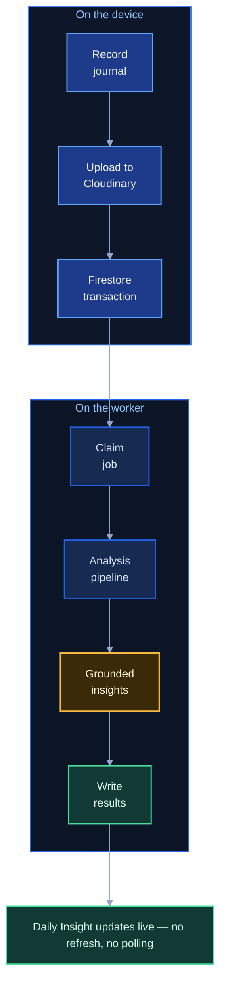
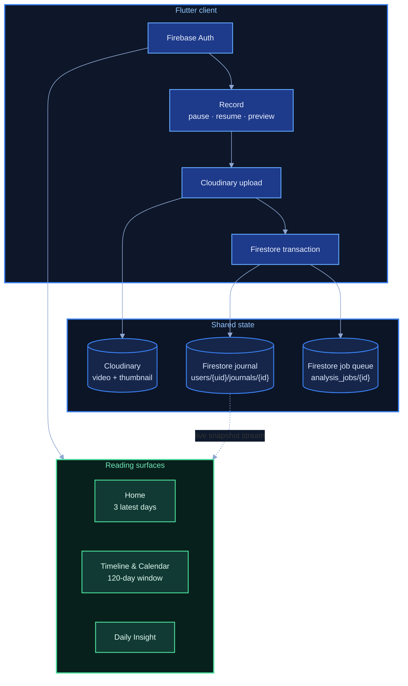
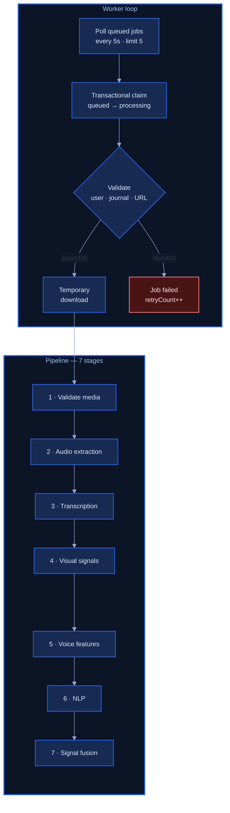
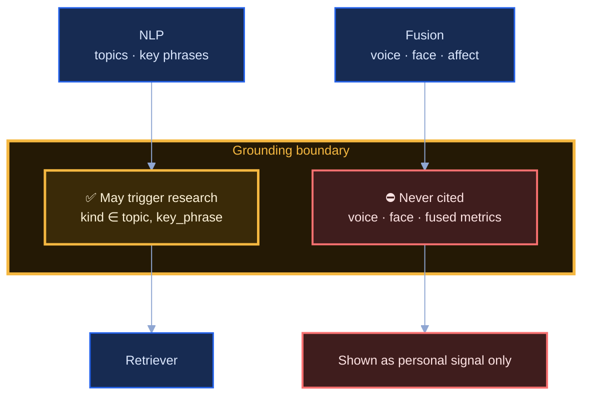
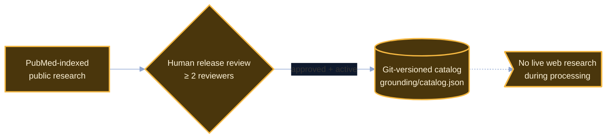
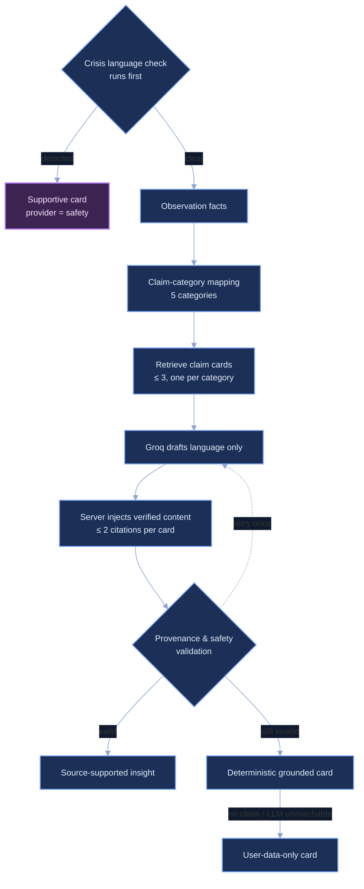
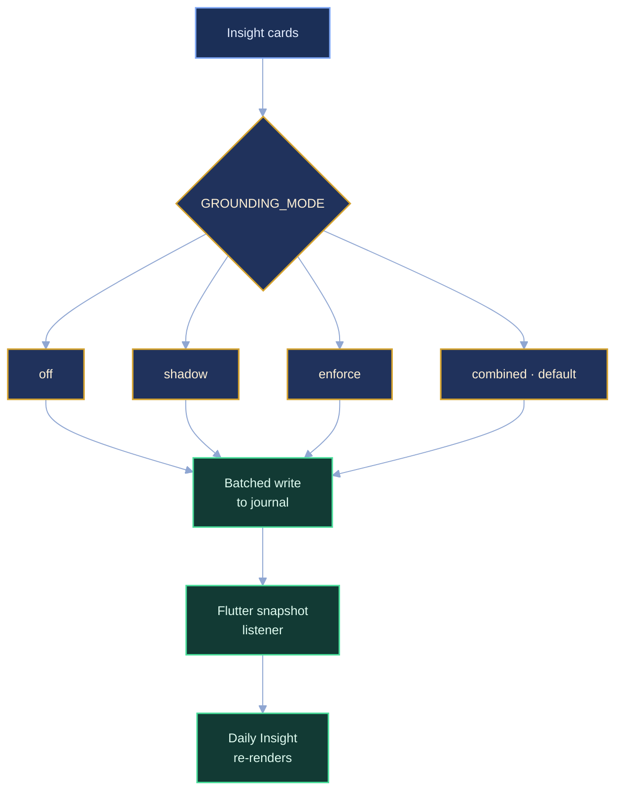

# Solenne — System Architecture (clean view)

A simplified, readable companion to [`docs/architecture-diagram.md`](../architecture-diagram.md).
Same system, same invariants — but the diagram carries **only the flow**, and all the
detail lives in the tables below it.

Solenne is **two independent apps that share no code**: a Flutter client and a Python
analyzer worker. There is no HTTP API between them — **Firestore is both the job queue
and the message bus**, and Cloudinary is the media store.

Two invariants get visual weight:

- **Grounding boundary** — only transcript-derived signals (topics, key phrases) may
  trigger a research-supported claim. Voice, face and fused affect metrics cannot.
- **Release-controlled catalog** — every citation comes from a human-reviewed,
  Git-versioned catalog. No live web research happens during journal processing.

---

## 1 · End-to-end flow

The whole system at a glance — eight steps, one direction, grouped by where they run.

| Stage | Where it runs | Source |
|---|---|---|
| Record journal | Flutter client | `screens/recording/` |
| Upload to Cloudinary | Flutter client | `services/cloudinary/cloudinary_upload_service.dart` |
| Firestore transaction | Flutter client | `journal_repository.dart : saveJournal` |
| Worker claims job | Python worker | `worker/runner.py : watch()` |
| Analysis pipeline | Python worker | `pipeline/orchestrator.py` |
| Grounded insights | Python worker | `grounding/runtime.py` |
| Results written | Python worker | `worker/result_mapper.py` |
| Daily Insight updates | Flutter client | `journalByIdStreamProvider` |

---

## 2 · Client and shared state

The client only ever *creates* — every later write to a journal comes from the worker.

| Collection | Written by | Notes |
|---|---|---|
| `users/{uid}/journals/{journalId}` | client (create only), then worker | transcript · analysis · aiInsights · evidence · diagnostics · status |
| `analysis_jobs/{journalId}` | client (create, `status == 'queued'` only), then worker | status · processingStep · retryCount; index `status ASC, createdAt ASC` |

---

## 3 · Worker and analysis pipeline

| Stage | Tooling | Output |
|---|---|---|
| 1 · Validate media | OpenCV probe | duration, readability |
| 2 · Audio extraction | FFmpeg | mono 16 kHz WAV |
| 3 · Transcription | Faster Whisper, int8 CPU, VAD | transcript |
| 4 · Visual signals | OpenCV Haar cascades | frame quality, facial signals |
| 5 · Voice features | librosa | energy, pitch, pause ratio |
| 6 · NLP | — | topics · key phrases · word count · confidence · sentiment · stress |
| 7 · Signal fusion | face 0.35 · voice 0.35 · text 0.30 | valence · arousal · congruence |

Download safety: HTTPS only, no redirects, 500 MB cap, auto-purged temp directory,
3 retries with exponential backoff (`worker/media_source.py`).

---

## 4 · Grounding boundary

The one structural rule in the system. Enforced by `retriever.py`, not by prompt text.

`retrieve_claims` only counts facts whose `kind` is `topic` or `key_phrase`, so voice,
face and fused metrics have **no code path** to a research claim
(`grounding/retriever.py:20`).

---

## 5 · Catalog governance

The catalog stores sources, **exact display claims**, limitations, support levels and
approved suggestions. No source text is ever copied at runtime.

---

## 6 · Insight generation and fallback ladder

Three rungs on the ladder:

1. Two generate/validate attempts against the LLM.
2. A deterministic grounded card that still carries a real citation.
3. A user-data-only card — no citation.

Rung 2 is deliberately skipped when the LLM was never reachable, so a bare template
never gets a citation attached to it.

Groq drafts **title, summary, themes, mood, questions and allowed IDs** only — it never
writes claims or citations. The server injects exact evidence values, catalog claim text,
approved suggestions, limitations and canonical HTTPS citations. Validation checks that
no IDs were fabricated, no values altered, and catalog text is byte-identical.

---

## 7 · Runtime modes and delivery

| Mode | Written to `aiInsights` | Also written |
|---|---|---|
| `off` | existing insight pipeline output | — |
| `shadow` | existing output, unchanged | grounded output → `groundingShadowInsights` |
| `enforce` | validated grounded output only | — |
| `combined` *(default)* | narrative cards + grounded cards together | — |

The client needs no refresh and does no polling: the Daily Insight screen is bound to a
live snapshot listener on the same journal document, so it updates the moment the worker
commits its batch.

---

## Legend

| Colour | Layer |
|---|---|
| 🔵 Sapphire | Flutter client |
| 🔷 Deep blue cylinders | Cloud services — Cloudinary, Firestore |
| 🔹 Navy | Worker and analysis pipeline |
| 🟡 Gold | Grounding boundary and catalog governance |
| 🔴 Red | Blocked or failed paths |
| 🟣 Purple | Crisis-safety path |
| 🟠 Amber | `GROUNDING_MODE` routing |
| 🟢 Green | Result delivery |

Shapes: `[( )]` datastore · `{ }` decision · `> ]` annotation.

---

## Diagram ↔ code

| Section | Source |
|---|---|
| Client | `frontend/lib/features/auth/auth_providers.dart`, `frontend/lib/screens/recording/`, `frontend/lib/services/cloudinary/cloudinary_upload_service.dart`, `frontend/lib/features/journals/journal_repository.dart` |
| Reading surfaces | `frontend/lib/screens/home/home_screen.dart:570`, `screens/timeline/timeline_screen.dart`, `screens/insights/daily_insight_screen.dart` |
| Firestore schema and rules | `firestore.rules`, `firestore.indexes.json`, `backend/solenne_analyzer/worker/result_mapper.py` |
| Worker loop | `backend/solenne_analyzer/worker/runner.py`, `worker/firebase_gateway.py` |
| URL validation and download | `backend/solenne_analyzer/worker/media_source.py` |
| Analysis pipeline | `backend/solenne_analyzer/pipeline/orchestrator.py`, `pipeline/{media,transcribe,face,voice,nlp,fusion}.py` |
| Grounding boundary | `backend/solenne_analyzer/grounding/retriever.py:20`, `grounding/observations.py` |
| Grounding pipeline | `backend/solenne_analyzer/grounding/runtime.py`, `generator.py`, `assembler.py`, `validators.py` |
| Catalog governance | `backend/solenne_analyzer/grounding/catalog.py`, `grounding/catalog.json`, `grounding/models.py` |
| Runtime modes | `backend/solenne_analyzer/pipeline/llm_insights.py`, `config.py` |

---

## Notes on accuracy

- **Face analysis uses OpenCV Haar cascades**, not MediaPipe (`pipeline/face.py`).
  `backend/README.md` still says MediaPipe and is out of date.
- **Four runtime modes exist**, not three. `combined` is what `backend/.env.example`
  ships today.
- **Claim limits differ by stage**: the retriever supplies up to **3** claim cards to the
  model (`runtime.py:94`); the assembler renders at most **2** citations per card
  (`assembler.py:34`).
- **`analysis_jobs/{journalId}`** uses the journal ID as its document ID, and the client
  may only create that document with `status == 'queued'`.
