# Solenne — System Architecture

Solenne is an AI-powered video journaling application built as **two independent apps that share no code**: a Flutter client (`frontend/`) and a Python analyzer worker (`backend/solenne_analyzer/`). There is no HTTP API between them — **Firestore is both the job queue and the message bus**, and Cloudinary is the media store. The client writes a journal and a queued job in a single transaction; the worker polls, claims, analyzes, and writes results back to the same journal document; the client is listening on a live snapshot stream and updates itself the moment processing completes.

The diagram below documents the **actual runtime as implemented**, not an aspirational design. Two invariants are given deliberate visual weight:

- **The grounding boundary** — only transcript-derived signals (topics, key phrases) may ever trigger a source-supported research claim. Voice, face, and fused affect metrics are structurally barred from doing so.
- **Release-controlled catalog** — every research citation comes from a human-reviewed, Git-versioned catalog. **No live web research happens during journal processing.**

---

## Architecture diagram

```mermaid
%%{init: {
  "theme": "base",
  "themeVariables": {
    "background": "#0B1220",
    "fontFamily": "Inter, Segoe UI, Helvetica, sans-serif",
    "fontSize": "13px",
    "primaryColor": "#1E3A8A",
    "primaryTextColor": "#E8EEFB",
    "primaryBorderColor": "#2563EB",
    "lineColor": "#7C93C3",
    "textColor": "#E8EEFB",
    "clusterBkg": "#0F1A2E",
    "clusterBorder": "#2A3F63",
    "edgeLabelBackground": "#0F1A2E"
  },
  "flowchart": { "curve": "basis", "nodeSpacing": 46, "rankSpacing": 58, "padding": 14 }
}}%%
flowchart TB

%% ═══════════════════════ 1. FLUTTER CLIENT ═══════════════════════
subgraph CLIENT["&nbsp;📱 &nbsp;FLUTTER CLIENT &nbsp;— &nbsp;user-facing&nbsp;"]
  direction TB
  AUTH["<b>Firebase Authentication</b><br/>sign in · sign up · session<br/><i>features/auth/auth_providers.dart</i>"]
  REC["<b>Video journal recording</b><br/>record · pause · resume · preview<br/><i>screens/recording/</i>"]
  UP["<b>Cloudinary upload</b><br/>unsigned multipart POST<br/>video + derived thumbnail"]
  TX["<b>Firestore transaction</b><br/>journal + analysis job + user<br/>written atomically<br/><i>journal_repository.dart : saveJournal</i>"]

  subgraph VIEWS["&nbsp;Navigation &amp; reading surfaces&nbsp;— &nbsp;live from Firestore&nbsp;"]
    direction LR
    HOME["<b>Home</b><br/>three latest<br/>recorded days"]
    TL["<b>Timeline<br/>&amp; Calendar</b><br/>120-day window"]
    DI["<b>Daily Insight</b><br/>playback · AI insights<br/>evidence · research sources"]
  end

  AUTH --> REC --> UP --> TX
  AUTH --> VIEWS
end

%% ═══════════════════════ 2. CLOUD SERVICES ═══════════════════════
subgraph CLOUD["&nbsp;☁️ &nbsp;CLOUD SERVICES &nbsp;— &nbsp;managed state&nbsp;"]
  direction LR
  CLD[("<b>Cloudinary</b><br/>video asset<br/>+ thumbnail<br/><i>solenne/journals/</i>")]
  FSJ[("<b>Firestore — journal</b><br/><i>users/{uid}/journals/{journalId}</i><br/>transcript · analysis · aiInsights<br/>evidence · diagnostics · status")]
  FSQ[("<b>Firestore — job queue</b><br/><i>analysis_jobs/{journalId}</i><br/>status · processingStep · retryCount<br/>index: status ASC, createdAt ASC")]
end

UP -- "video + thumbnail" --> CLD
TX -- "journal doc<br/>(create-only from client)" --> FSJ
TX -- "job doc, status = queued" --> FSQ

%% ═══════════════════════ 3. ANALYZER WORKER ═══════════════════════
subgraph WORKER["&nbsp;⚙️ &nbsp;PYTHON ANALYZER WORKER &nbsp;— &nbsp;backend processing&nbsp;"]
  direction TB
  POLL["<b>Poll queued jobs</b><br/>every 5s · limit 5 · ordered by createdAt<br/><i>worker/runner.py : watch()</i>"]
  CLAIM["<b>Transactional claim</b><br/>re-check queued → flip to processing<br/><i>safe for concurrent workers</i>"]
  VAL{"<b>Validate</b><br/>user · journal<br/>· Cloudinary URL"}
  DL["<b>Temporary download</b><br/>https · no redirects · 500 MB cap<br/>auto-purged temp directory<br/>3 retries, exponential backoff"]
  FAILV["<b>Job failed</b><br/>errorMessage · retryCount++"]

  POLL --> CLAIM --> VAL
  VAL -- "rejected" --> FAILV
  VAL -- "accepted" --> DL
end

FSQ -- "status == queued" --> POLL
CLD -- "stream video over HTTPS" --> DL

%% ═══════════════════════ 4. ANALYSIS PIPELINE ═══════════════════════
subgraph PIPE["&nbsp;🎬 &nbsp;RECORDING-ANALYSIS PIPELINE &nbsp;— &nbsp;local, on-worker&nbsp;"]
  direction TB
  P1["<b>1 · Validate media</b> — OpenCV probe, duration"]
  P2["<b>2 · Audio extraction</b> — FFmpeg → mono 16 kHz WAV"]
  P3["<b>3 · Transcription</b> — Faster Whisper, int8 CPU, VAD"]
  P4["<b>4 · Visual signals</b> — OpenCV quality + facial signals"]
  P5["<b>5 · Voice features</b> — librosa energy, pitch, pause ratio"]
  P6["<b>6 · NLP</b> — topics · key phrases · word count<br/>confidence · sentiment · stress"]
  P7["<b>7 · Signal fusion</b> — face 0.35 · voice 0.35 · text 0.30<br/>valence · arousal · congruence"]

  P1 --> P2 --> P3 --> P4 --> P5 --> P6 --> P7
end

DL --> P1

%% ═══════════════════════ 5. GROUNDING BOUNDARY ═══════════════════════
subgraph BOUND["&nbsp;🔒 &nbsp;GROUNDING BOUNDARY &nbsp;— &nbsp;enforced in code, not by convention&nbsp;"]
  direction LR
  ELIG["<b>✅ &nbsp;ELIGIBLE TO TRIGGER RESEARCH</b><br/>transcript <b>topics</b> and <b>key phrases</b> only<br/><i>retriever.py — kind ∈ {topic, key_phrase}</i>"]
  INEL["<b>⛔ &nbsp;NEVER TRIGGERS OR JUSTIFIES A CLAIM</b><br/>voice · face · fused metrics<br/>arousal · valence · congruence · stress<br/><i>no code path reaches the retriever</i>"]
  DEAD>"Displayed as personal signal only —<br/>never cited, never source-supported"]
  INEL --> DEAD
end

P6 -- "transcript-derived only" --> ELIG
P7 -- "affect metrics" --> INEL

%% ═══════════════════════ 6. CATALOG GOVERNANCE ═══════════════════════
subgraph GOV["&nbsp;📚 &nbsp;CATALOG GOVERNANCE &nbsp;— &nbsp;release-controlled, offline&nbsp;"]
  direction LR
  PUB["<b>PubMed-indexed<br/>public research</b>"]
  REV{"<b>Human catalog-<br/>release review</b><br/>≥ 2 reviewers<br/>approved + active"}
  CAT[("<b>Git-versioned catalog</b><br/><i>grounding/catalog.json</i> · v2026-07-v1<br/>sources · exact display claims<br/>limitations · support levels<br/>approved suggestions")]
  NOWEB>"<b>No live web research</b><br/>during journal processing —<br/>no source text is ever copied"]

  PUB --> REV -- "approved for release" --> CAT
  CAT -.-> NOWEB
end

%% ═══════════════════════ 7. GROUNDING PIPELINE ═══════════════════════
subgraph GROUND["&nbsp;🧭 &nbsp;GROUNDING PIPELINE &nbsp;— &nbsp;AI grounding&nbsp;"]
  direction TB
  CRISIS{"<b>Crisis / self-harm<br/>language check</b><br/><i>deterministic, runs first</i>"}
  SAFE["<b>Deterministic supportive card</b><br/>bypasses ordinary AI generation entirely<br/>provider = safety"]
  FACTS["<b>Deterministic observation facts</b><br/>built from transcript + NLP only"]
  MAP["<b>Deterministic claim-category mapping</b><br/>5 categories: journaling · rest · workload<br/>social connection · grounding routines"]
  RETR["<b>Retrieve eligible claim cards</b><br/><b>≤ 3 retrieved</b>, one per category<br/>ranked by support level, then signal strength"]
  GROQ["<b>Groq drafts language only</b><br/>title · summary · themes · mood<br/>questions · allowed IDs<br/><i>never writes claims or citations</i>"]
  INJ["<b>Server injects verified content</b><br/>exact evidence values · catalog claim text<br/>approved suggestions · limitations<br/>canonical HTTPS citations<br/><b>≤ 2 references rendered per card</b>"]
  CHK{"<b>Deterministic provenance<br/>&amp; safety validation</b><br/>no fabricated IDs · values unaltered<br/>catalog text byte-identical"}
  OK["<b>Source-supported insight</b><br/>verification = source_supported"]
  DET["<b>Deterministic grounded card</b><br/>real citation, no model prose<br/><i>only if the LLM was reachable</i>"]
  UDO["<b>User-data-only card</b><br/>journal observations, no citation"]

  CRISIS -- "crisis language detected" --> SAFE
  CRISIS -- "clear" --> FACTS --> MAP --> RETR --> GROQ --> INJ --> CHK
  CHK -- "valid" --> OK
  CHK -. "retry once with feedback" .-> GROQ
  CHK -- "still invalid" --> DET
  DET -- "no claim matched<br/>or LLM unreachable" --> UDO
end

ELIG --> CRISIS
CAT -- "approved claims only" --> RETR

%% ═══════════════════════ 8. RUNTIME MODES ═══════════════════════
subgraph MODES["&nbsp;🎛️ &nbsp;GROUNDING RUNTIME MODES &nbsp;— &nbsp;GROUNDING_MODE&nbsp;"]
  direction TB
  MODE{"<b>Which mode<br/>is configured?</b>"}
  MOFF["<b>off</b><br/>existing insight pipeline<br/>writes to <b>aiInsights</b>"]
  MSHA["<b>shadow</b><br/>existing output stays in <b>aiInsights</b><br/>grounded output stored privately<br/>in <b>groundingShadowInsights</b>"]
  MENF["<b>enforce</b><br/>only validated grounded output<br/>is written to <b>aiInsights</b>"]
  MCOM["<b>combined</b> &nbsp;— &nbsp;<i>current default</i><br/>narrative cards + grounded cards<br/>together in <b>aiInsights</b>"]

  MODE --> MOFF
  MODE --> MSHA
  MODE --> MENF
  MODE --> MCOM
end

OK --> MODE
SAFE --> MODE
UDO --> MODE

%% ═══════════════════════ 9. RESULT DELIVERY ═══════════════════════
subgraph DELIVER["&nbsp;📡 &nbsp;RESULT DELIVERY &nbsp;— &nbsp;back to the user&nbsp;"]
  direction TB
  WRITE["<b>Analyzer writes results</b><br/>→ <i>users/{uid}/journals/{journalId}</i><br/>transcript · processing results · evidence<br/>diagnostics · insights<br/><i>batched write · job status → complete / failed</i>"]
  STREAM["<b>Flutter live Firestore stream</b><br/>snapshot listener on the same journal doc<br/><i>journalByIdStreamProvider</i>"]
  UPDATE["<b>Daily Insight updates automatically</b><br/>the moment processing completes<br/><i>no refresh, no polling in the client</i>"]
  PLAY["<b>Cloudinary streams<br/>the saved video</b><br/>inline playback from<br/>the stored asset"]
  LINK["<b>Valid HTTPS research links</b><br/>open on the external publisher<br/>or PubMed page"]
  BACK>"Re-renders Home · Timeline · Daily Insight<br/>— the client surfaces at the top of this diagram"]

  WRITE --> STREAM --> UPDATE
  UPDATE --> PLAY
  UPDATE --> LINK
  UPDATE -.-> BACK
end

MOFF --> WRITE
MSHA --> WRITE
MENF --> WRITE
MCOM --> WRITE
FAILV --> WRITE

%% ═══════════════════════ STYLING ═══════════════════════
classDef client    fill:#1E3A8A,stroke:#60A5FA,stroke-width:1.5px,color:#EAF1FF
classDef cloud     fill:#15264A,stroke:#3B82F6,stroke-width:1.5px,color:#DCE8FF
classDef worker    fill:#172B52,stroke:#2563EB,stroke-width:1.5px,color:#DCE8FF
classDef pipeline  fill:#12224A,stroke:#2563EB,stroke-width:1.2px,color:#DCE8FF
classDef boundary  fill:#3A2A08,stroke:#F5B841,stroke-width:2.5px,color:#FFF4DA
classDef blocked   fill:#3F1D1D,stroke:#F87171,stroke-width:2px,color:#FFE4E4
classDef ground    fill:#1B2F57,stroke:#7DA6F5,stroke-width:1.5px,color:#E4EDFF
classDef gold      fill:#4A360C,stroke:#F5B841,stroke-width:2px,color:#FFF4DA
classDef mode      fill:#20325C,stroke:#D4A22F,stroke-width:1.6px,color:#FFF1D6
classDef deliver   fill:#123A34,stroke:#4ADE9B,stroke-width:1.5px,color:#DFFBF0
classDef danger    fill:#4A1414,stroke:#F87171,stroke-width:1.6px,color:#FFE4E4
classDef safety    fill:#3D2352,stroke:#C084FC,stroke-width:1.8px,color:#F5E9FF

class AUTH,REC,UP,TX,HOME,TL,DI client
class CLD,FSJ,FSQ cloud
class POLL,CLAIM,VAL,DL worker
class FAILV danger
class P1,P2,P3,P4,P5,P6,P7 worker
class ELIG boundary
class INEL,DEAD blocked
class PUB,REV,CAT,NOWEB gold
class CRISIS,FACTS,MAP,RETR,GROQ,INJ,CHK,OK,DET,UDO ground
class SAFE safety
class MODE,MOFF,MSHA,MENF,MCOM mode
class WRITE,STREAM,UPDATE,PLAY,LINK deliver

style CLIENT   fill:#0D1729,stroke:#3B82F6,stroke-width:2px,color:#93C5FD
style VIEWS    fill:#101F3A,stroke:#2A3F63,stroke-width:1px,color:#93C5FD
style CLOUD    fill:#0C1526,stroke:#3B82F6,stroke-width:2px,color:#93C5FD
style WORKER   fill:#0C1526,stroke:#2563EB,stroke-width:2px,color:#93C5FD
style PIPE     fill:#0C1526,stroke:#2563EB,stroke-width:2px,color:#93C5FD
style BOUND    fill:#241905,stroke:#F5B841,stroke-width:3px,color:#F5B841
style GOV      fill:#241905,stroke:#D4A22F,stroke-width:2px,color:#F5B841
style GROUND   fill:#0C1526,stroke:#7DA6F5,stroke-width:2px,color:#93C5FD
style MODES    fill:#141326,stroke:#D4A22F,stroke-width:2px,color:#F5B841
style DELIVER  fill:#08201C,stroke:#4ADE9B,stroke-width:2px,color:#6EE7B7
```

---

## Legend

| Color | Layer | Meaning |
|---|---|---|
| 🔵 Sapphire | Flutter client | User-facing screens and actions |
| 🔷 Deep blue (cylinders) | Cloud services | Managed storage — Cloudinary and Firestore |
| 🔹 Navy | Worker & pipeline | Backend processing on the analyzer |
| 🟡 **Gold border** | Grounding boundary & catalog | Governance controls — the safety-critical rails |
| 🔴 Red | Blocked / failed paths | Signals that may never justify a claim; failed jobs |
| 🟣 Purple | Safety path | Crisis handling, bypasses AI generation |
| 🟠 Amber | Runtime modes | `GROUNDING_MODE` routing |
| 🟢 Green | Result delivery | Data flowing back to the user |

Node shapes: `[( )]` = datastore · `{ }` = decision point · `> ]` = annotation/terminal note.

---

## Diagram ↔ code

| Diagram section | Source |
|---|---|
| Flutter client | `frontend/lib/features/auth/auth_providers.dart`, `frontend/lib/screens/recording/`, `frontend/lib/services/cloudinary/cloudinary_upload_service.dart`, `frontend/lib/features/journals/journal_repository.dart` |
| Home / Timeline / Daily Insight | `frontend/lib/screens/home/home_screen.dart:570`, `frontend/lib/screens/timeline/timeline_screen.dart`, `frontend/lib/screens/insights/daily_insight_screen.dart` |
| Firestore schema & rules | `firestore.rules`, `firestore.indexes.json`, `backend/solenne_analyzer/worker/result_mapper.py` |
| Worker poll / claim / states | `backend/solenne_analyzer/worker/runner.py`, `worker/firebase_gateway.py` |
| URL validation & download | `backend/solenne_analyzer/worker/media_source.py` |
| Analysis pipeline | `backend/solenne_analyzer/pipeline/orchestrator.py` and `pipeline/{media,transcribe,face,voice,nlp,fusion}.py` |
| Grounding boundary | `backend/solenne_analyzer/grounding/retriever.py:20`, `grounding/observations.py` |
| Grounding pipeline | `backend/solenne_analyzer/grounding/runtime.py`, `generator.py`, `assembler.py`, `validators.py` |
| Catalog governance | `backend/solenne_analyzer/grounding/catalog.py`, `grounding/catalog.json`, `grounding/models.py` (`runtime_eligible`) |
| Runtime modes | `backend/solenne_analyzer/pipeline/llm_insights.py`, `config.py` (`GROUNDING_MODE`) |

---

## Notes on accuracy

Details in this diagram that are easy to get wrong, verified against the code:

- **Face analysis uses OpenCV Haar cascades**, not MediaPipe (`pipeline/face.py`). `backend/README.md` currently says MediaPipe and is out of date.
- **Four runtime modes exist**, not three. `combined` serves narrative and grounded cards side by side and is what `backend/.env.example` ships today.
- **Claim limits differ by stage**: the retriever supplies up to **3** claim cards to the model (`runtime.py:94`), while the assembler renders at most **2** citations per insight card (`assembler.py:34`).
- **The fallback ladder has three rungs**: two generate/validate attempts → a deterministic grounded card that still carries a real citation → a user-data-only card. The deterministic rung is deliberately skipped when the LLM was never reachable, so a bare template never gets a citation attached to it.
- **The grounding boundary is structural.** `retrieve_claims` only counts facts whose `kind` is `topic` or `key_phrase`, so voice, face, and fused metrics have no code path to a research claim at all — the boundary is enforced by the retriever, not by prompt instructions.
- **`analysis_jobs/{journalId}`** uses the journal ID as its document ID, and the client may only ever create that document with `status == 'queued'`; all later job writes come from the Admin SDK worker.
