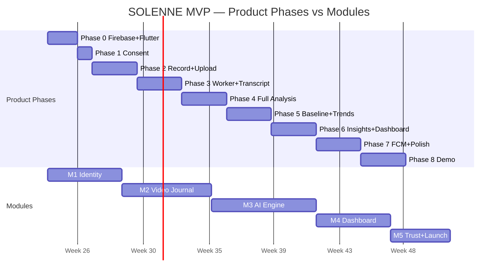
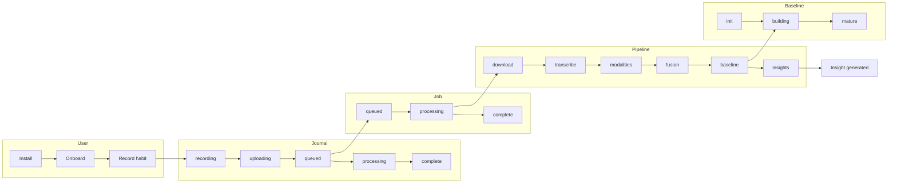

# SOLENNE — Master Lifecycle Overview

**Purpose:** Shows how all lifecycles connect across the 24-week MVP.

---

## 1. Lifecycle Hierarchy

SOLENNE has four layers of lifecycle, from macro to micro:

```
┌─────────────────────────────────────────────────────────────────┐
│  PRODUCT LIFECYCLE (24 weeks, Phases 0–8)                       │
│  "When does the whole MVP ship?"                                │
└────────────────────────────┬────────────────────────────────────┘
                             │ contains
                             ▼
┌─────────────────────────────────────────────────────────────────┐
│  MODULE LIFECYCLE (M1–M5, ~4–7 weeks each)                      │
│  "Who owns what chunk of the app?"                              │
└────────────────────────────┬────────────────────────────────────┘
                             │ each module runs
                             ▼
┌─────────────────────────────────────────────────────────────────┐
│  SDLC (Plan → Design → Implement → Test → Deploy → Handoff)     │
│  "How does each feature get built?"                             │
└────────────────────────────┬────────────────────────────────────┘
                             │ produces runtime behavior
                             ▼
┌─────────────────────────────────────────────────────────────────┐
│  ENTITY LIFECYCLES (user, journal, job, baseline, insight…)     │
│  "What happens at runtime when someone uses the app?"           │
└─────────────────────────────────────────────────────────────────┘
```

---

## 2. Timeline Map (Product ↔ Modules ↔ Milestones)



| Engineering Milestone | Product Phase | Module | User-visible outcome |
|----------------------|---------------|--------|---------------------|
| **M0** Dev Environment | Phase 0 | M1 start | Team runs app locally |
| **M1** First Upload | Phase 2 | M2 | "I recorded my first journal" |
| **M2** First Analysis | Phase 3–4 | M3 | "I see AI results on my video" |
| **M3** First Trend | Phase 5 | M4 | "I see my 7-day emotional chart" |
| **M4** First Insight | Phase 6 | M4 | "I got a personalized insight" |
| **M5** Beta Ready | Phase 7 | M5 | "I can delete my account safely" |
| **M6** Demo Launch | Phase 8 | M5 + Integration | Class demo works |

---

## 3. Runtime Data Flow (Entity Lifecycles)

When a user records a journal, **five entity lifecycles** run in parallel:



**Cross-reference:** See `entity/` folder for state diagrams, transitions, and owners per entity.

---

## 4. SDLC Inside Every Module

Each module (M1–M5) repeats the same **7 SDLC stages** for every feature inside it:

| SDLC Stage | Module equivalent | Output |
|------------|-------------------|--------|
| **Plan** | Module kickoff | Scope agreed, owner assigned |
| **Design** | Pre-dev checklist | Env ready, rules deployed |
| **Implement** | Build sprint | Code + unit tests |
| **Test** | QA pass | P0 tests from Test Catalog |
| **Deploy** | Merge + Firebase deploy | Rules/features live |
| **Handoff** | Exit gate + `docs/handoffs/M{N}.md` | Next owner unblocked |
| **Maintain** | Bug fixes during next module | Issues logged |

---

## 5. Consent Gates Across Lifecycles

Consent affects **three lifecycles** simultaneously:

| Lifecycle | Consent impact |
|-----------|----------------|
| **User Journey** | Onboarding must capture face/voice/text toggles |
| **Analysis Pipeline** | Worker skips face/NLP per consent at job start |
| **Consent & Data** | Revoke in M5 → next journal respects new state |

**Rule:** Snapshot consent at **job processing start**, not upload time (user may revoke while queued).

---

## 6. Baseline Gates Insight Lifecycle

Insights do not generate until the **Baseline Lifecycle** reaches minimum maturity:

| Baseline phase | Days/entries | Insight behavior |
|----------------|--------------|------------------|
| Init | Entry 1 | No insights; baseline confidence ~0.05 |
| Building | 2–6 entries | Insights suppressed (confidence < 0.6) |
| Approaching | 5 in 7 days | Confidence 0.4–0.6; limited templates |
| Mature | 14–21 days | Full insight generation; confidence ≥ 0.6 |

---

## 7. Release Lifecycle (Final Weeks)

After M5 ships, the **Release & Demo Lifecycle** runs:

```
Integration → Seed Data → Rehearsal → Demo Day → Retrospective → Post-MVP backlog
```

See `release/Release-Demo-Lifecycle.md`.

---

## 8. Which Lifecycle Doc to Open

| You are… | Open |
|----------|------|
| Planning the semester | `product/README.md` + Phase docs |
| Starting your module turn | `modules/M{N}-*.md` |
| Building a single feature | `sdlc/Stage-03-Implement.md` |
| Debugging upload stuck | `entity/Journal-Entry-Lifecycle.md` |
| Debugging worker | `entity/Analysis-Job-Lifecycle.md` + `Analysis-Pipeline-Lifecycle.md` |
| Preparing class demo | `release/Release-Demo-Lifecycle.md` |
| Onboarding new teammate | This doc + `01-Environment-Setup.md` |

---

## 9. Lifecycle Rules (Team Agreement)

1. **Never skip module order** — M2 requires M1 exit gate.
2. **Never ship without exit gate** — checklist in module doc.
3. **Product phase can overlap modules** — phases are calendar view; modules are ownership view.
4. **Entity lifecycles are spec, not sprint** — implement when the owning module ships.
5. **One handoff doc per module** — required before rotation.

---

*Next: pick a subfolder README for the lifecycle you're working on.*
